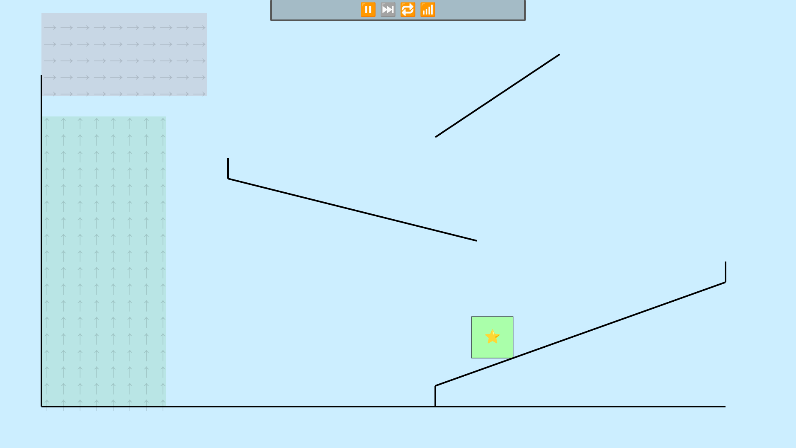

# Physics

2D physics simulation.

The physics engine is currently extremely buggy. The block may fly in random directions for no discernible reason.

## Features
* Wall collision will (try to) work no matter how high the velocity

## Roadmap
* [ ] Friction on walls
* [ ] Water
* [ ] Intentional bouncing
* [ ] Collisions between objects
* [ ] Moving walls
* [ ] Breakable walls
